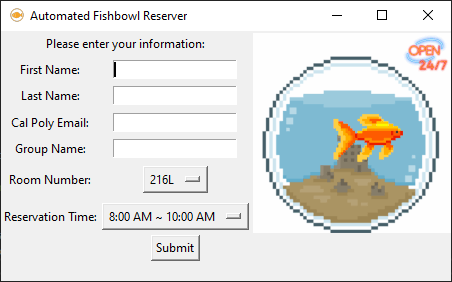

# Automated Fishbowl

This was created in order to remove the effort required to reserve a fishbowl.

# Initial Setup and UI

The application will allow the user to input the information neccessary to reserve their respective fishbowl time slots. After the first time, the input will be stored in a text file called "user_info.txt", and no input will be necessary. The user may edit the file directly if there needs to be a change made. The file can also be deleted to trigger the UI to showup again.

# Automation
The code is written in Python and uses Selenium to web scrape. This code utilizes the ChromeDriver, so it will only run on Chrome. Due to the nature of ChromeDriver, the version of the ChromeDriver and Chrome must be the same. Please see the link below if the preinstalled ChromeDriver version does not match your current Chrome version.

[ChromeDriver](https://chromedriver.chromium.org/downloads)

The application also needs to be scheduled by the Task Scheduler in order to be useful.

# Furture Updates
* Automated email confirmation
  * Current version doesn't confirm the email automatically. Once school is back in session, I will write code that can achieve this.
* Fully test the application
  * With school not in session, I couldn't test the current version. Will be tested once the fishbowl reservations are back.
* MacOS version
  * I don't have a Mac to develop this application, so if anyone wants to make one you are more than welcome to.
